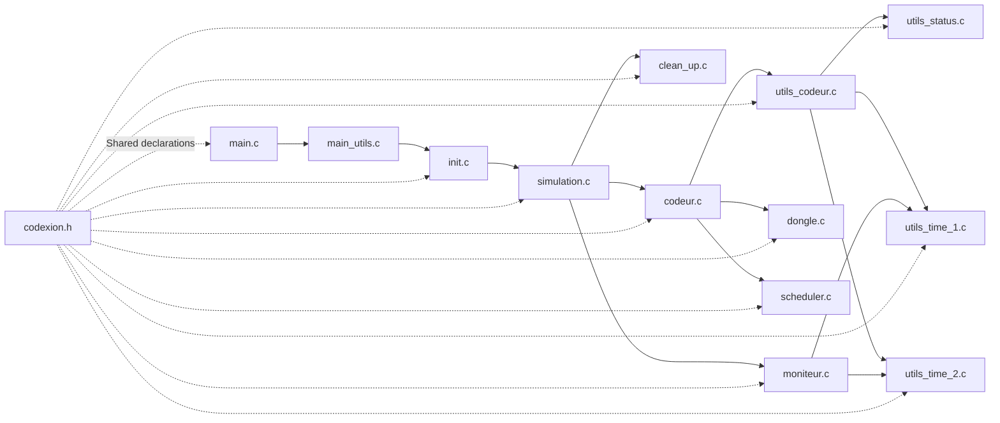
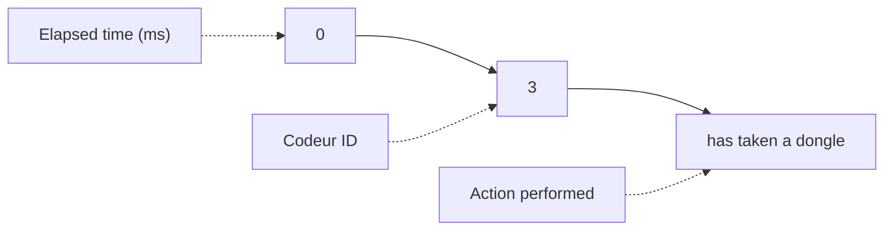

_This project has been created as part of the 42 curriculum by lebeyssa._


# Codexion

## Description

Codexion is a multi-threaded simulation inspired by the Dining Philosophers problem.

Codeurs (developers) share limited resources called "dongles". To compile, a codeur must acquire two dongles.

Each codeur runs in its own thread and follows a cycle:
- take two dongles;
- compile;
- release dongles;
- debug;
- refactor.

The project uses POSIX threads (`pthread`), mutexes, and condition variables to handle synchronization and resource sharing.

Two scheduling algorithms are implemented:
- <font color="#f49922">FIFO</font>: the first codeur waiting gets priority.
- <font color="#f49922">EDF</font> (Earliest Deadline First)**: the codeur with the closest deadline gets priority.

The objective is to manage concurrent access to shared resources while avoiding deadlocks and starvation.

- projet structure :

## Blocking cases handled :

- **Deadlock prevention**  
Every coder always acquires dongles in the same global order (lowest address/index first, highest second). This removes circular wait conditions and prevents deadlocks.


- **Dongle cooldown**  
After being released, a dongle enters a cooldown period before it can be acquired again. Threads waiting for the dongle sleep on a condition variable instead of busy-waiting.
- **Priority scheduling (EDF)**  
When the EDF scheduler is enabled, waiting coders are granted access according to the earliest deadline (last_compile + time_to_burnout), reducing the risk of starvation for coders close to burning out.
- **FIFO scheduling**  
When EDF is disabled, waiting coders are served in first-in, first-out order using the waiting queue.
- **Thread synchronization**  
Shared resources (waiting queue, cooldown timestamp, stop flag, last compile timestamp, finish state, etc.) are protected with mutexes to avoid race conditions.

## Thread synchronization mechanisms :

- **Mutexes**
		
	- Each dongle is protected by its own mutex to ensure exclusive access.
	- Additional mutexes protect shared state such as:
		- simulation stop flag,
		- last compile timestamp,
		- finish status,
		- console output.
- **Condition variables**
	- Each dongle has a condition variable used to suspend waiting threads.
	- Threads are awakened when the dongle becomes available or its cooldown expires, avoiding busy-waiting.
- **Ordered resource acquisition**
	- Dongles are always acquired in a deterministic order, preventing circular waits and deadlocks.
- **EDF / FIFO scheduling**
	- Waiting threads are selected according to the configured scheduling policy:
		- FIFO: first thread to wait gets the resource first.
		- EDF: the thread with the earliest deadline receives priority.
- **Protected shared data**
	- All shared variables that may be accessed concurrently are synchronized through mutexes to prevent data races.

## Instructions

**Makefile command :**

Compile the project:

- <font color="#f49922"> make </font>  

clean object files:  
- <font color="#f49922">make</font> clean

Remove all generated files: 
- <font color="#f49922">make</font> fclean

Recompile :  
- <font color="#f49922">make</font> re

**Execution**

Run the program:
- ./codexion number_of_coders time_to_burnout time_to_compile time_to_debug time_to_refactor number_of_compilations scheduler

**exemple :** 

- ./codexion <font color="#f49922">20 100 10 10 10 3 </font>edf

**datauments :** 


- `number_of_coders` : number of codeurs in the simulation
- <code>time_to_burnout</code> : maximum time before a codeur burns out
- <code>time_to_compile</code> : compilation duration
- <code>time_to_debug</code> : debugging duration
- <code>time_to_refactor</code> : refactoring duration
- <code>number_of_compilations</code> : required number of compilations
- <code>scheduler</code> : scheduling algorithm (<code>fifo</code> or <code>edf</code>)

**output exemple :**

```
 /Documents/codexion  ./codexion 4 20 0 0 0 1 0 fifo                                                                                                                                                    
0 3  has taken a dongle
0 3  has taken a dongle
0 3  is compiling
0 3  is debugging
0 3  is refactoring
0 1  has taken a dongle
0 1  has taken a dongle
0 1  is compiling
0 1  is debugging
0 1  is refactoring
1 2  has taken a dongle
1 2  has taken a dongle
1 2  is compiling
1 2  is debugging
1 2  is refactoring
1 4  has taken a dongle
1 4  has taken a dongle
1 4  is compiling
1 4  is debugging
1 4  is refactoring
```

**Output description :**

`0 3  has taken a dongle`



## Resources

**learn mutli threading** : https://www.geeksforgeeks.org/c/multithreading-in-c/

**Mutex** : https://www.codequoi.com/threads-mutex-et-programmation-concurrente-en-c/

**lib pthread.h** : https://pubs.opengroup.org/onlinepubs/7908799/xsh/pthread.h.htm

**tester** by Oscorpy : https://github.com/Oscorpyy/Codextion_tester

**visualizer** by sacha : https://codexion-visualizer.sacha-dev.me/


